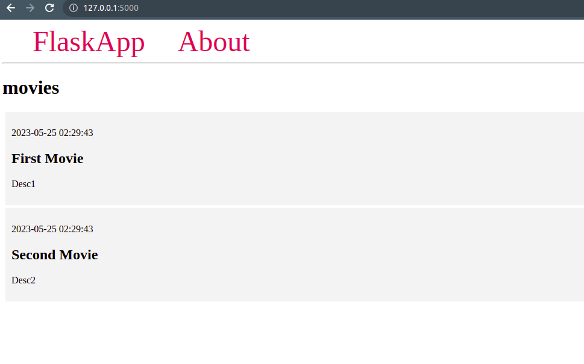

# IMDb_Database_Project

### Disclaimer
This is a very rudimentary flask app wherein we have copied the steps from the following tutorial for a very basic UI: https://www.digitalocean.com/community/tutorials/how-to-use-an-sqlite-database-in-a-flask-application. Moreover, we will change the code later on but just for setting up the application, we opted to use the steps mentioned in the link. 

### How to Run 

1. Create a python virtual environment in the main directory.
2. Run the following to get the correct versions we are using. 
```
pip install -r requirements.txt
```
3. Run the following in the project directory:
```
export FLASK_APP=app
export FLASK_ENV=development
flask run
```
4. Should see the local website on http://127.0.0.1:5000/. 
Should look like the following:
