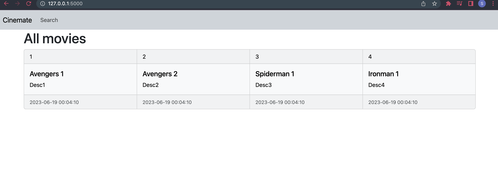
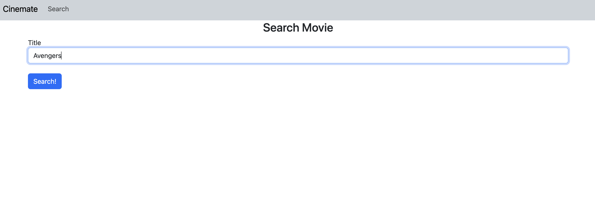
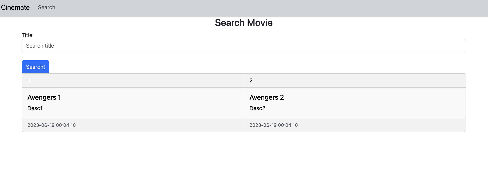

# IMDb_Database_Project

### Disclaimer
This is a very rudimentary flask app with a low fidelity design. The app supports a case sensitive search by movie title.

### How to Run 

1. Create a python virtual environment in the main directory.
```
python3 -m venv env
source env/bin/activate
```
2. Run the following to get the correct versions we are using. 
```
pip install -r requirements.txt
```
3. Run the following in the project directory (optional --debug flag for code reload):
```
export FLASK_ENV=development
flask --app app.py --debug run
```
4. You should see the local website on http://127.0.0.1:5000/. 


5. FEATURE: Navigating to search page and making a "case-sensitive" search.

