# IMDb_Database_Project

### Overview
Our app is called Cinemate: a mix between Netflix and Spotify! We wanted to add a social aspect to tracking movies we've watched. Currently, the app supports the following features: 
- login/signup/update uder information
- a case sensitive search by movie title, genre, and actor. 
- recommendations of new movies to watch
- recommendations of movies to rewatch
- recommendations of movies based on movies you've liked
- recommendations of movies based on your genre/actor likes
- recommendations of movies based on you and one of your friends' combined tastes
- see your connections based on people you follow, like LinkedIn's connections

### How to Load Sample Database

In the [toy_dataset/data](toy_dataset/data) folder, there is a folder for raw tsv.gz files. These files were the files taken from the [IMDb datasets](https://developer.imdb.com/non-commercial-datasets/). Using these files and Python scripts, we created CSV files representing each table. We then read these CSV files to load the database in [load_toy_dataset.py](load_toy_dataset.py).

#### Load Dataset
The file [load_toy_dataset.py](load_toy_dataset.py) has a function to load the dataset from the CSV files to any database using a connection from SQLite. To use this function, simply import the sqlite library and load_toy_dataset as a custom module, make a connection with sqlite, and pass the connection as a parameter to the load_toy_dataset function. 

The file [use_toy_dataset.py](toy_dataset/use_toy_dataset.py) has an example of this.

#### Change Dataset
To change either the Actor, ActorRole, Genre, MovieGenre, Starred, or Movie table, go to [create_toy_movie_dataset.py](toy_dataset/create_toy_movie_dataset.py) and make the changes you wish to make there. For the rest of the table, you can go to [create_toy_user_dataset.py](toy_dataset/create_toy_user_dataset.py) and make the changes there. We use pandas to store temporary tables. 
If you run the file, make sure that the current path is in the toy_dataset directory. 

#### Other
To change filenames used, go to [toy_dataset_consts.py](toy_dataset/toy_dataset_consts.py). To examine or create handy functions with SQL that will be reused, go to [use_toy_dataset_util.py](toy_dataset/use_toy_dataset_util.py). In particular, there is a shuffle function in this file where we can shuffle the CSV data, so it is more randomized when entered into the database. We also have a file [add_custom_data.py](toy_dataset/add_custom_data.py), which we use to add non-randomly created data to the databases. 

### Production Database
The information for the production database follows the information of the sample database. Simply replace any instance of "toy" with "prod", except the folder name (which we replace "toy" with "production"). There are a couple differences in how the data is generated: We read from a firstname file and lastname file from the raw data folder to generate about 7000 users. Other than that, there are no differences, other than how many rows are generated for each table (ex. 20 movies for sample -> 10000 movies for production)

### How to Run Application

1. Create a python virtual environment in the main directory.

For Linux or Mac
```
python3 -m venv env
source env/bin/activate
```

For Windows
```
python3 -m venv env
.\env\Scripts\activate
```
2. Run the following to get the correct versions we are using. 
```
pip install -r requirements.txt
```
3. Run the following in the project directory (optional --debug flag for code reload):

For Linux or Mac
```
export FLASK_ENV=development
flask --app app.py --debug run
```

For Windows

```
set FLASK_ENV=development
flask --app app.py --debug run
```

If you want to login with a user who has movies watched, liked, and is following other users, use the following credentials:
- username: ellenbelbeck
- password: abcABC1234

4. You should see the local website on http://127.0.0.1:5000/. 
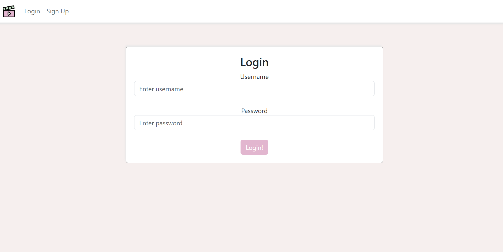

5. If you are a new user you can sign up. 


FANCY FEATURE: The sign up and storage of password is secure as the passwords are hashed and there are strong password restrictions. You only have 5 sign-in attempts before the website prevents you from signing in for ten minutes.

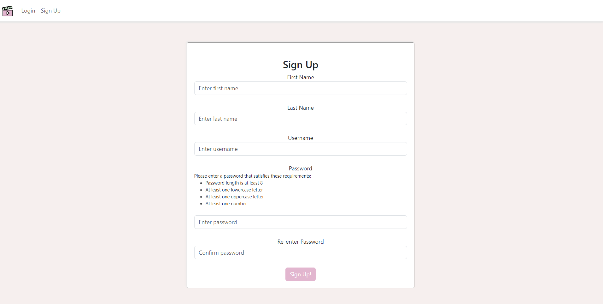

6. After login/sign-up you should see the home page for movie recommendations.
   

   FANCY FEATURE: Logged in user will be "remembered". This means unless the user logs out or the flask server is shutdown, user will remain signed in.
   
   
   UI FEATURE: Tooltips available upon hovering the movie card
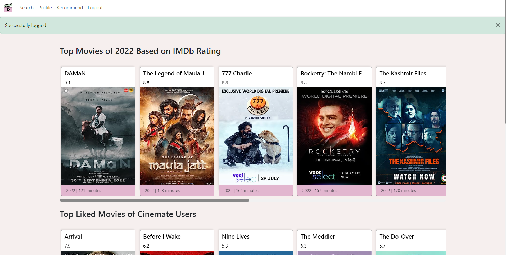

7. FEATURE: You can navigate to the search page and search by title, genre, or actor and sort by rating, year released and runtime in ascending and descending order.
Your search does not need to be exact.
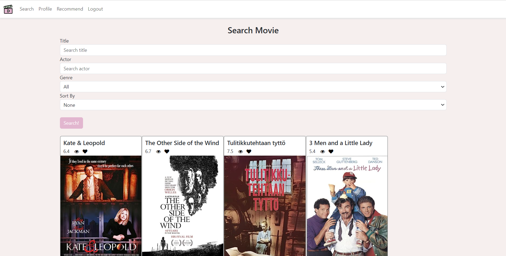

8. Clicking the "Recommend" button in the navigation will take you to the recommend page.

   FEATURE: The Recommend page will automatically load movies you haven't watched


   FEATURE: The Recommend page will automatically load movie cards of movies you have previously watched (having watched them over 30 days ago) and liked, and will recommend them to you to rewatch

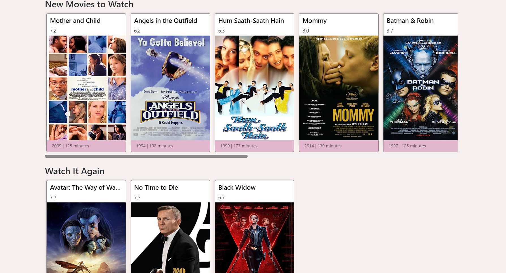

9. 
FEATURE: The recommend page will automatically load movie cards of movies you might like based on your your liked movies. 

FEATURE: The recommend page will automatically load movie cards of movies you might like based on the movies people you've followed have liked.

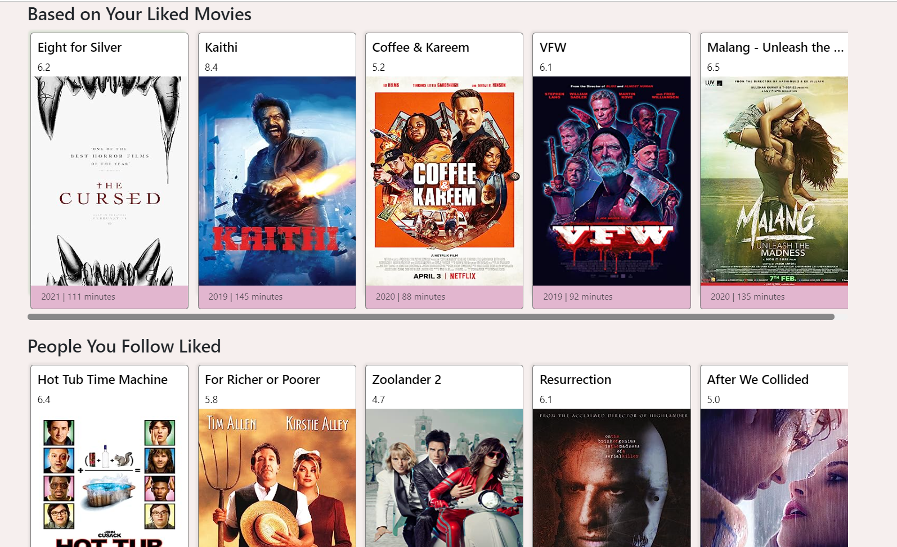

10. FEATURE: The recommend page will automatically load movie cards of movies you might like based on your Genre and Actor likes. These movies are ones you, the user, has not watched yet.

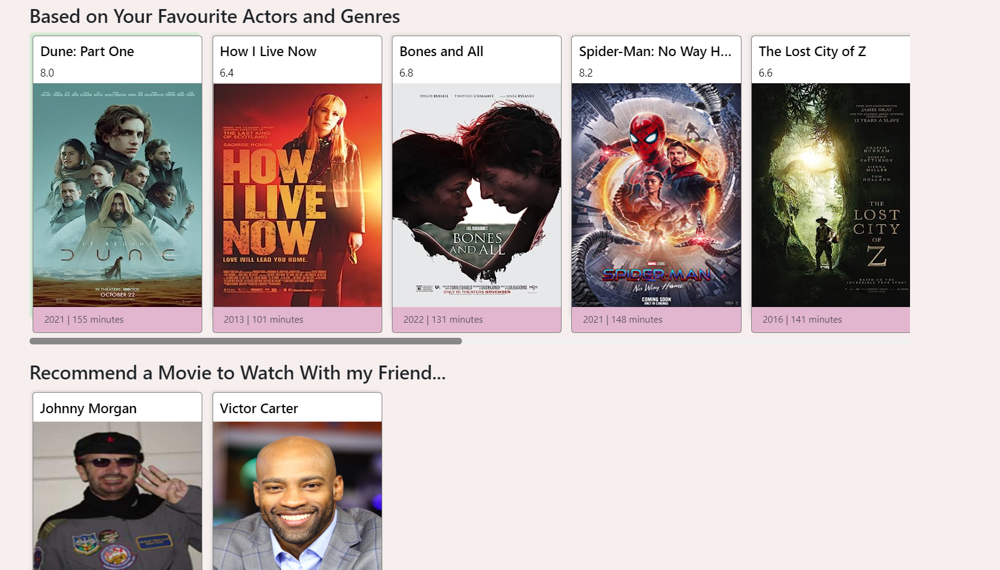


11. FEATURE: As part of the Recommend page, you can click on the username within the user card in order to get recommendations of movies to watch with this other user. This other user is one who you follow and also follows you

After clicking on one of the username buttons the following loads
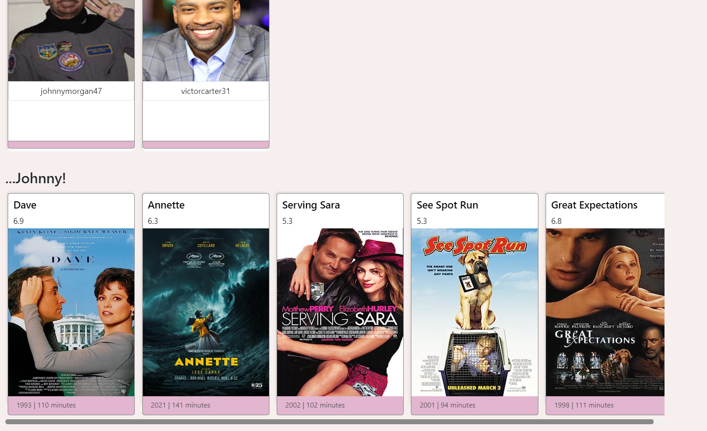

12. FEATURE: On the Profile page, you can follow and unfollow users. 
You can view your followers:
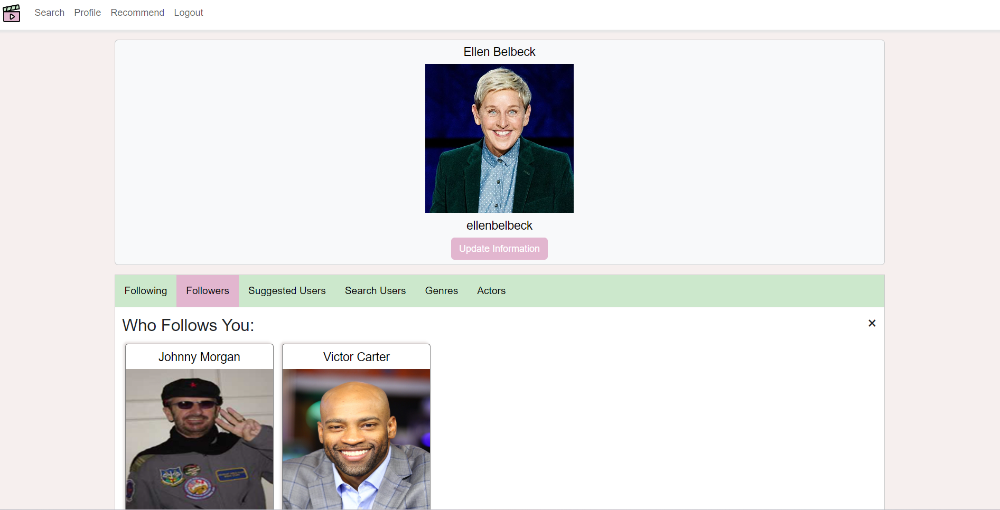
See who you are following:
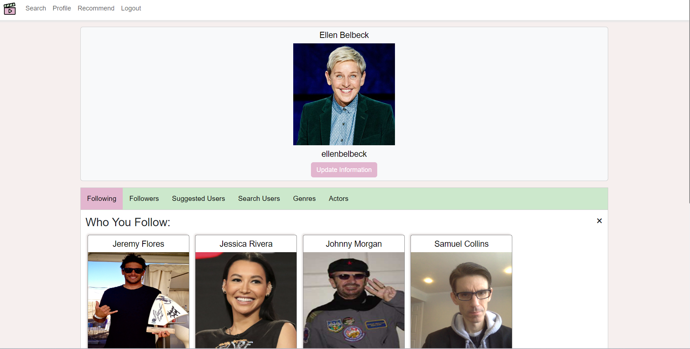
See followers of users you follow:
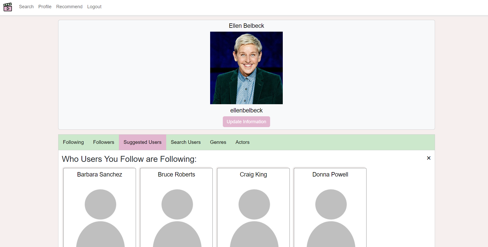
Search for other users:
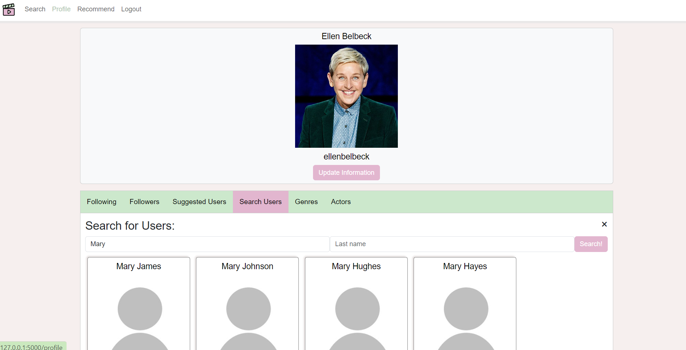
You can also click the Update Information button to update your display name and/or password:
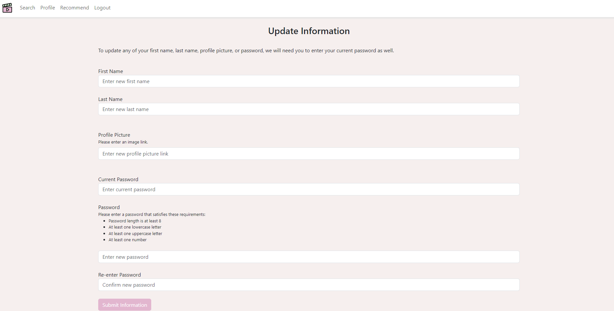

13. Once you are all done you can logout. 


14. FANCY FEATURE: Unit testing. Run the following to execute unit tests
```
python -m unittest discover -s tests -p "test_*.py" -v 
```

15. FANCY FEATURE: Indexes.

We have added indexes in [schema.sql](schema.sql) that has been proven to speed up our complex queries. To test our schema against other schemas, go to the [compare_schemas](compare_schemas) folder. There, you can run [compare_schemas.py](compare_schemas/compare_schemas.py), which compares the average runtime for our queries for 100 queries against all schemas in the folder. Below is an example of a run.

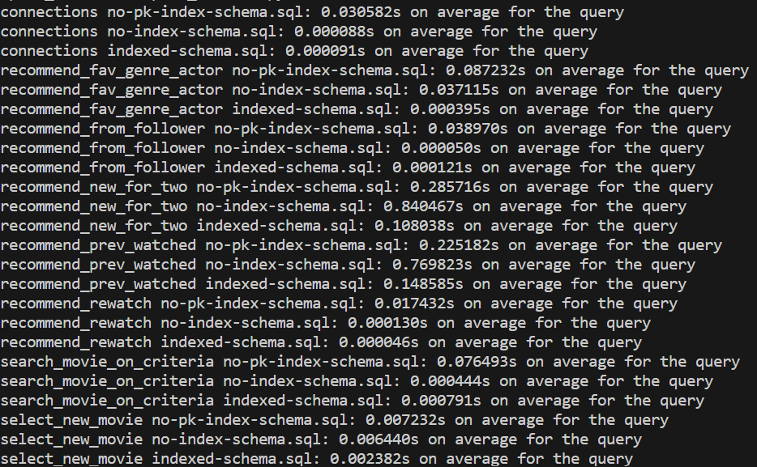


16. FANCY FEATURE: Fuzzy Searching.
The new updates to this feature involve fuzzy searching. Rapid Fizz is a python library that performs string matching using Levenshtein distances (based on FuzzyWuzzy). We compare this edit distance to generate a similarity score to all entries in the database for movies and actors. Below is an example of a search.


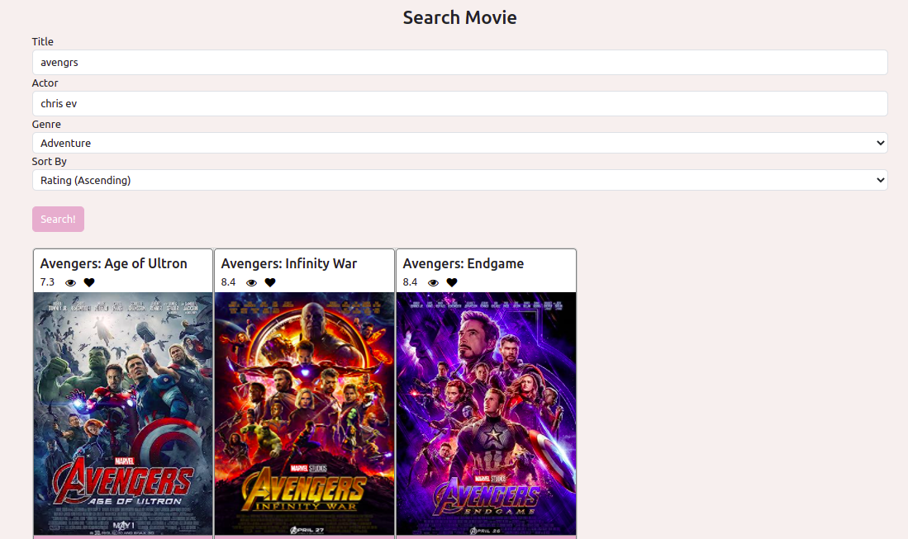


17. FANCY FEATURE: SQL Injection Protection

SQL injection is “ a common attack vector that uses malicious SQL code for backend database manipulation to access information that was not intended to be displayed” (Imperva). This can be used to login and get sensitive information from users. In order to ensure that we were protected against it, we used placeholders and parameterized statements. Moreover, we tested the code by running a sqlmap scan on all pages. None had any injectable parameters.
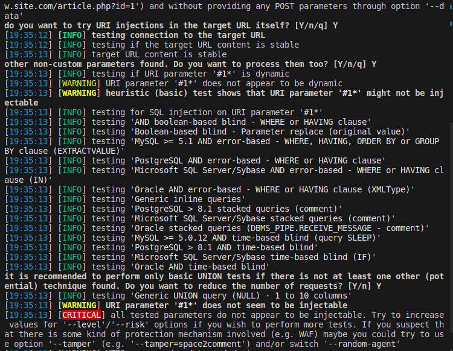
