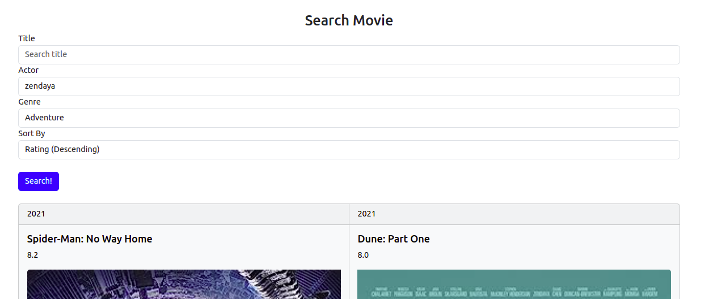

# IMDb_Database_Project

### Overview
Our app is called Cinemate: a mix between Netflix and Spotify! We wanted to add a social aspect to tracking movies we've watched. Currently, the app supports one feature: a case sensitive search by movie title, genre, and actor. 

### How to Load Sample Database
In the [toy_dataset/data](toy_dataset/data) folder, there is a folder for raw tsv.gz files. These files were the files taken from the [IMDb datasets](https://developer.imdb.com/non-commercial-datasets/). Using these files and Python scripts, we created CSV files representing each table. We then read these CSV files to load the database in [load_toy_dataset.py](load_toy_dataset.py).

#### Load Dataset
The file [load_toy_dataset.py](load_toy_dataset.py) has a function to load the dataset from the CSV files to any database using a connection from SQLite. To use this function, simply import the sqlite library and load_toy_dataset as a custom module, make a connection with sqlite, and pass the connection as a parameter to the load_toy_dataset function. 

The file [use_toy_dataset.py](toy_dataset/use_toy_dataset.py) has an example of this.

#### Change Dataset
To change either the Actor, ActorRole, Genre, MovieGenre, Starred, or Movie table, go to [create_toy_movie_dataset.py](toy_dataset/create_toy_movie_dataset.py) and make the changes you wish to make there. For the rest of the table, you can go to [create_toy_user_dataset.py](toy_dataset/create_toy_user_dataset.py) and make the changes there. We use pandas to store temporary tables. 

#### Other
To change filenames used, go to [toy_dataset_consts.py](toy_dataset/toy_dataset_consts.py). To examine or create handy functions with SQL that will be reused, go to [use_toy_dataset_util.py](toy_dataset/use_toy_dataset_util.py).

### How to Run Application

1. Create a python virtual environment in the main directory.

For Linux or Mac
```
python3 -m venv env
source env/bin/activate
```

For Windows
```
python3 -m venv env
.\env\Scripts\activate
```
2. Run the following to get the correct versions we are using. 
```
pip install -r requirements.txt
```
3. Run the following in the project directory (optional --debug flag for code reload):

For Linux or Mac
```
export FLASK_ENV=development
flask --app app.py --debug run
```

For Windows

```
set FLASK_ENV=development
flask --app app.py --debug run
```
4. You should see the local website on http://127.0.0.1:5000/. 


5. If you are a new user you can sign up. FANCY FEATURE: The sign up and storage of password is secure as the passwords are hashed.


6. After login/sign-up you should see the home page for movie recommendations. FANCY FEATURE: Logged in user will be "remembered". This means unless the user logs out or the flask server is shutdown, user will remain signed in.


5. FEATURE: You can navigate to the search page and search by title, genre, or actor and sort by rating, year released and runtime in ascending and descending order.
Your search does not need to be exact.


8. Once you are all done you can logout. 

